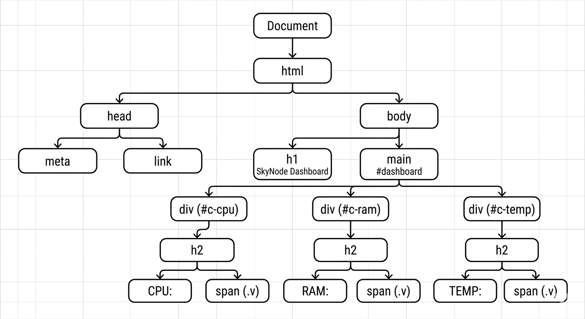

# 🚀 SkyNode Monitoring Solutions
**Sistema de Monitoramento de Hardware em Tempo Real**

Este projeto é uma aplicação Full Stack básica que monitora CPU, RAM e Temperatura, desenvolvida para a avaliação prática de Desenvolvimento de Sistemas.

---

## 👤 Identificação
* **Estudante:** [Leonardo teixeira christo]
* **Turma:** Informática 3°E
* **Instituição:** SENAI AP

---

## 🛠️ Tecnologias
* **Back-end:** Node.js com Express
* **Front-end:** HTML5, CSS3 (Modern Dark Mode) e JavaScript (OOP)
* **Comunicação:** API Fetch (JSON)

---
## 📋 Como rodar o projeto localmente

Siga os passos abaixo no seu terminal/prompt de comando:

1. **Instalar as dependências:**
   ```bash
   
   npm install 
   
   iniciar o servidor:

    node server.js

    Acessar o Dashboard:
    Abra o seu navegador e digite o endereço:
    http://localhost:3000

    